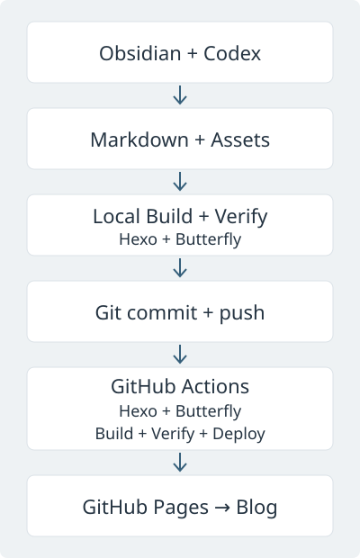

我原本已经有一个 Obsidian 私人知识库，用来记录工作笔记、项目经验、AI 学习、各类知识和私人记录。后来，我希望有一个自己的 Blog，把其中值得公开的内容整理出来，慢慢积累成文章。

这个想法决定了搭建方式：保留原来的知识库，另建一个用于公开写作的 Vault。Obsidian 继续负责写作，Codex 帮我整理内容和维护项目，Hexo 把 Markdown 生成网站，再交给 GitHub Pages 托管。

这篇文章记录的是当前这个 Blog 的结构和取舍，也给以后的自己留一份维护说明。

## 先把私人笔记和公开写作分开

两个 Vault 的边界很明确：**Jerry Knowledge Base 是私人知识库，Jerry Blog 默认按可公开内容管理。**

私人笔记可以保留原始想法、工作上下文和暂时没有结论的记录。公开文章则需要筛选、补足说明，并检查客户资料、项目资料和个人信息是否适合披露。我不希望一次普通的 Git 提交，就把这些原始记录带进公开仓库。

所以，我没有直接把私人 Vault 变成网站，而是单独建立 Jerry Blog。Git、Hexo、主题和公开图片都放在这里，维护网站时也不会影响主知识库。

```text
Jerry Knowledge Base（私人）
        ↓
私人思考 / 原始笔记
        ↓
人工筛选、整理并检查公开范围
        ↓
Jerry Blog（默认可公开）
        ↓
公开发布
```

这一步由我决定，不做两个 Vault 之间的自动同步。需要 Codex 协助整理时，我会明确指定允许处理的文章，而不是让它遍历私人知识库。

边界也不只在网页上。公开 GitHub 仓库中的源码和提交历史同样可以被查看。`drafts/` 虽然被 Git 忽略，也不参与网站构建，但仍可能被 OneDrive 同步，不能当作私人资料的安全存储。`source/assets/` 更需要提前检查：即使某张图片没有被文章引用，它仍然是公开构建输入。

## 从 Markdown 到网站，各自负责什么

我把这套系统分成写作、构建和发布几部分。Butterfly 是 Hexo 构建时使用的主题，不是构建完成后再经过的一道独立服务。



### Obsidian 管内容，Markdown 留住文章

Obsidian 用来阅读和编辑文章、管理草稿与图片、调整文章结构。对我来说，它更像一个本地内容管理系统，也就是 Local-first CMS：内容先保存在自己的电脑上，写作不依赖网站后台。

文章的核心仍然是普通 Markdown 文件。标题、日期、分类和标签写在文件开头的 YAML Front Matter 中，正文和图片用标准 Markdown 表达。我尽量不用只能在 Obsidian 中识别的双链和图片嵌入语法，让同一份文件可以被 Obsidian 和 Hexo 理解。

以后换掉 Hexo 或托管平台，迁移的主要工作会是调整配置、元数据和附件路径，正文仍然可以继续使用。这是我选择这套方案的重要原因。

### Hexo 构建网站，Butterfly 负责页面

[Hexo](https://hexo.io/docs/) 是静态网站生成器，把 Markdown、配置、主题和资源生成 HTML、CSS、JavaScript 等文件。Node.js 用在本地构建和 GitHub Actions 中，访问网站时不需要一个长期运行的 Node.js 或 PHP 后端，也没有传统数据库。

Butterfly 负责首页、文章页、分类、标签、归档、深色模式、目录、搜索和响应式布局。当前配置保留了这些阅读功能，关闭了入场动画和大部分侧栏卡片，也没有接入评论或访问统计服务。我希望页面先适合读文章，再考虑要不要增加其他功能。

主题通过 npm 安装。外观调整放在 `_config.butterfly.yml` 和 `source/css/custom.css` 中，不改主题核心文件，这样以后升级时需要重新核对的改动更少。

### Git 记录修改，GitHub 接住发布流程

Git 保存文章、配置和页面设计的修改历史。我可以查看一篇文章怎么改过，也能在改坏配置后找回之前的版本。

GitHub 托管[这个源码仓库](https://github.com/jerryma0622-lgtm/jerryma0622-lgtm.github.io)，并提供 Actions 和 Pages。当前 `.github/workflows/pages.yml` 在 `main` 收到 push 时运行，也支持手动触发。

Actions 用 Node.js 24 和 `npm ci` 安装锁定依赖，执行构建与站点验证，再把 `public/` 作为构建产物交给 Pages 部署。整个流程采用 [GitHub Pages 的自定义工作流](https://docs.github.com/en/pages/getting-started-with-github-pages/using-custom-workflows-with-github-pages)，不用手动上传 HTML，也不需要维护一个存放生成文件的 `gh-pages` 分支。

最终网站地址是 [jerryma0622-lgtm.github.io](https://jerryma0622-lgtm.github.io/)。本地保存文章并不会更新网站，本地 commit 也不会触发部署，需要把提交 push 到 `main` 后，才会进入这条发布流程。

## Obsidian 和 Codex 打开的是同一个目录

现在 Obsidian 把 Jerry Blog 作为 Vault 打开，Codex 项目也连接到这个目录。两者操作的是同一套文件：

```text
Obsidian → Jerry Blog 文件系统 ← Codex
```

我在 Obsidian 中人工阅读和写作，Codex 则可以在这个项目里创建文章、整理结构、修改 Markdown、补充 Front Matter、管理分类和标签、检查图片与链接，以及维护 Hexo 配置和主题覆盖文件。它也可以执行构建、排查错误，按我的授权完成 Git 提交和推送。

这种协作不需要 Obsidian API 或额外的插件。Codex 改完文件，Obsidian 就能看到同一份内容。对目前的个人 Blog 来说，文件级协作已经足够直接。

我把维护约定写在仓库的 `AGENTS.md` 里，包括私人 Vault 的访问边界、正式文章和草稿的位置、构建检查，以及提交前的公开范围检查。Codex 可以协助执行这些工作，但公开内容由我确认，push 和部署也需要明确授权。

## OneDrive 同步文件，Git 保存版本

Jerry Blog 放在 OneDrive 的 Obsidian 目录下，因此文件可以随 OneDrive 在设备间同步。写作时仍然是 Obsidian 和 Codex 操作本地文件，然后由 Git 记录修改，GitHub 保存远程仓库并承接部署。

这几件事各有用途：OneDrive 负责文件同步，Git 负责版本历史，GitHub 负责远程源码托管、自动构建和网站发布。

这里有一个实际的维护细节：`.gitignore` 只决定 Git 忽略什么，不决定 OneDrive 同步什么。`node_modules/`、`public/` 和 `db.json` 不进入 Git，但它们生成在这个目录里时，仍可能被 OneDrive 同步。

目前我保留单目录方案。切换设备前先等待同步完成，避免两台电脑同时修改项目或操作同一份 `.git`。换电脑安装依赖时用 `npm ci`，也不会把 OneDrive 对 `.git` 的同步当作 Git 的 clone 或 pull。

## 当前仓库长什么样

下面列的是当前实际存在的主要目录和文件。依赖目录、构建产物和设备工作区状态没有列入。

```text
Jerry Blog/
├── .obsidian/
├── source/
│   ├── _posts/
│   │   └── building-my-personal-blog.md
│   ├── assets/
│   │   ├── posts/
│   │   └── site/
│   ├── about/
│   ├── categories/
│   ├── tags/
│   ├── projects/
│   ├── css/
│   └── js/
├── drafts/
├── scaffolds/
├── themes/
├── scripts/
├── tools/
├── .github/
│   └── workflows/
│       └── pages.yml
├── _config.yml
├── _config.butterfly.yml
├── package.json
├── package-lock.json
├── .gitignore
├── .gitattributes
├── .node-version
├── README.md
├── AGENTS.md
└── DESIGN.md
```

正式文章放在 `source/_posts/`，本地草稿放在 `drafts/`。文章附件按 slug 组织在 `source/assets/posts/` 下，站点图标等资源放在 `source/assets/site/`。从文章引用附件时，使用类似 `../assets/posts/building-my-personal-blog/architecture.svg` 的相对路径。

`scripts/asset-links.js` 会在构建时把指向公开附件的相对链接转换成网站的 `/assets/…` 路径，Markdown 源文件不变。这样 Obsidian 能按真实文件位置预览附件，网站也能正确加载它们。

`scaffolds/` 存放 Front Matter 模板，`tools/verify-site.cjs` 检查生成站点的链接和资源。`themes/` 是预留目录，Butterfly 的实际依赖由 npm 管理。归档页面由 Hexo 自动生成，所以源码中没有 `source/archives/`。

当前项目使用 Node.js 24.x、Hexo 8.1.2 和 Butterfly 5.7.0，通过 `package-lock.json` 固定依赖。`_config.yml` 管网站生成规则，`_config.butterfly.yml` 管主题配置，`DESIGN.md` 记录外观方向。

## 一篇文章怎样从笔记走到公开页面

日常流程不复杂，我希望以后维护时也能保持这样。

1. **先记录。** 原始想法留在私人知识库里，不急着按公开文章的标准写。
2. **再筛选。** 判断哪些内容值得公开，去掉不适合披露的资料，补上读者需要的背景，再整理到 Jerry Blog。
3. **在 Obsidian 中写。** 没写完的内容放在 `drafts/`，准备公开后移到 `source/_posts/`，检查标题、日期、分类、标签和附件路径。这里的草稿目录是项目自己的约定，不是 Hexo 的 `source/_drafts/`。
4. **让 Codex 协助检查。** 整理结构和格式，核对图片、站内链接、分类与标签。技术事实和公开范围仍由我确认。
5. **本地构建和预览，再提交发布。** 文章生成成功后，我还要看看真正的网页，尤其是目录、代码块和手机上的排版。

本地检查用项目已有的命令：

```bash
npx hexo clean
npm run build
npm run verify
npm run server
```

`npm run build` 对应 `hexo generate`。预览服务只绑定本机地址，打开 `http://127.0.0.1:4000/` 就能查看。验证脚本检查站内链接和附件，也检查草稿、仓库内部文件及本机绝对路径有没有进入公开输出。

确认内容和页面都可以公开后，我只暂存这次要发布的文件，检查暂存差异，再 commit。需要更新正式网站时，再明确执行 `git push origin main`，并查看 Actions 的构建和部署结果。这样，写作、提交和上线之间都有一个清楚的检查点。

## 我为什么愿意用这套方式长期写下去

我看重的是内容始终保存在自己能管理的文件里。Markdown、图片和配置可以备份，也可以迁移，托管服务只是把这些内容送到读者面前的发布层。写作先发生在本地，网站暂时不可用时，我仍然能继续写。

普通文件也适合 AI 辅助维护。Codex 可以参与写作、整理和开发，Git 则让这些修改有可检查的差异和历史。对于我现在的需求，静态网站不需要单独购买和维护服务器，但依赖更新、构建检查和内容整理仍然需要花时间。

这个 Blog 的定位是 **技术博客 × 数字花园 × 个人主页**。以后可能逐渐写 AI、Coding、Obsidian、项目管理、制造与自动化、B2B Sales、项目记录，也会写阅读、旅行、生活和随记。这些是准备积累的方向，目前并不是每个方向都有完整栏目或文章。

网站现在还很简单。我想先建立一个能长期积累、持续写作，并且由自己掌握内容的系统。以后技术栈可能会换，页面也可能重做，只要 Markdown 和附件还在，这个 Blog 就能继续迁移和演进。
